# Canada Weather & Radar

What’s it like in Canada? Cold. Need to know more? That’s where we come in. Canada Weather is a small, free weather app for Android that uses weather data from Environment Canada for your mobile weather-ing pleasure. Get animated radar imagery, current conditions, and the latest forecast in seconds for as many locations as you choose. Lookup locations by name, by proximity to any address, or by province. Links directly to the Environment Canada mobile site, caches weather information, and stores your favourite locations for a quick and easy user experience. Now includes animated radar imagery, improved widget dimensions, and some appearance options. At least 140,000 of you agree and have consistently rated this app the best of the Canadian Weather apps on the market.

[Get it on Google Play](https://play.google.com/store/apps/details?id=ca.fwe.caweather)

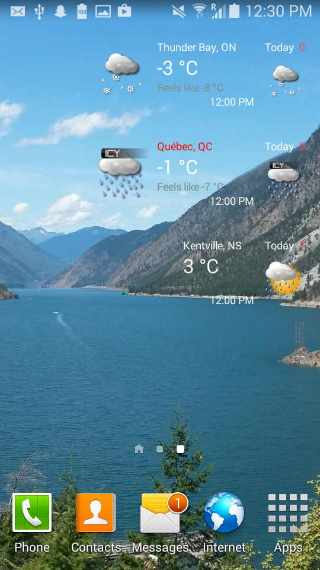 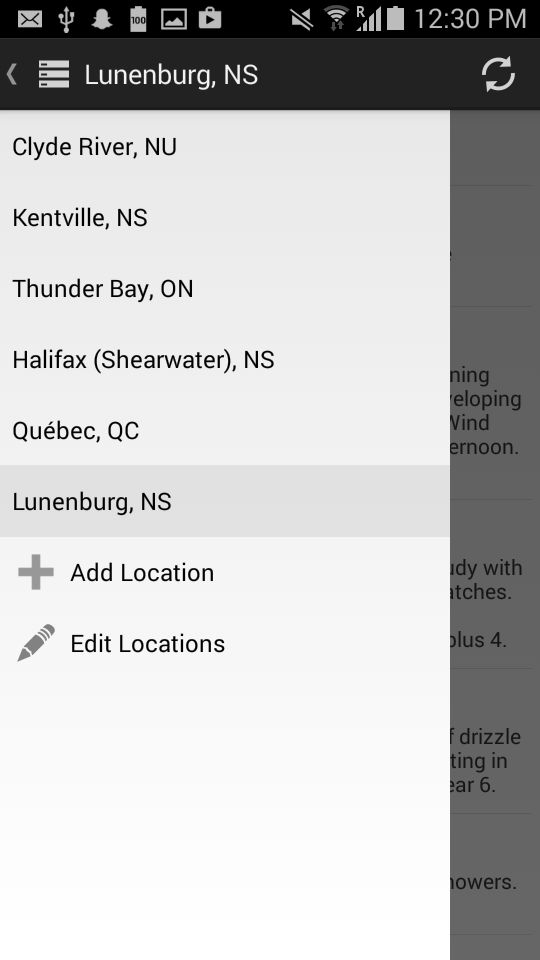 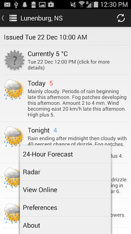 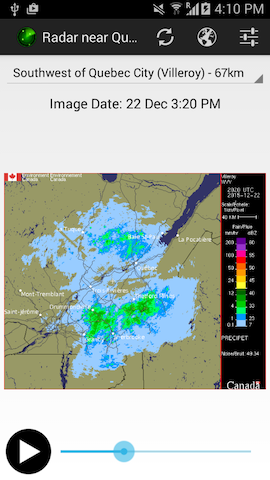 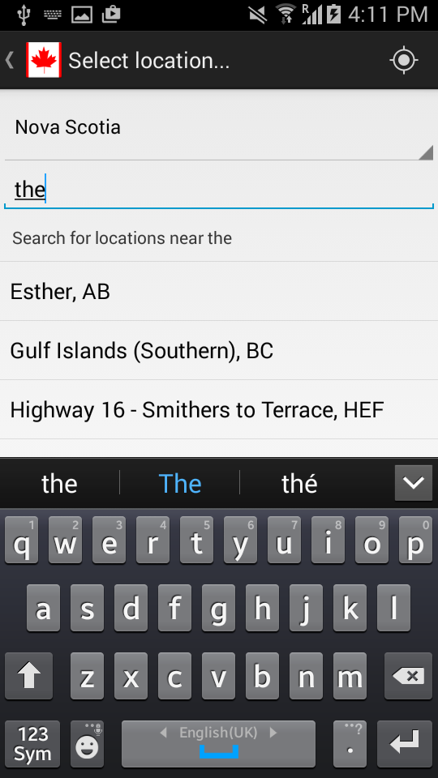 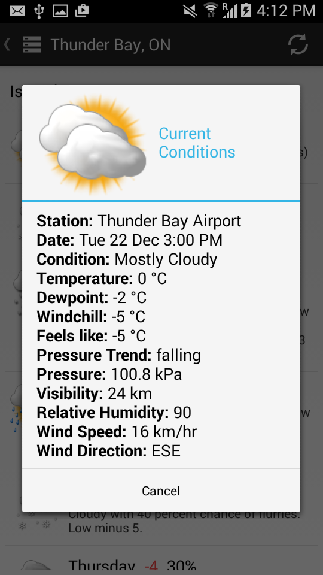 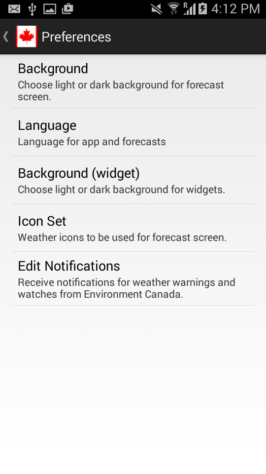 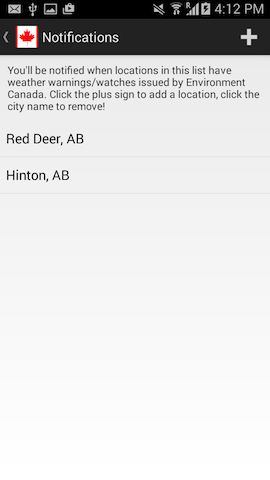  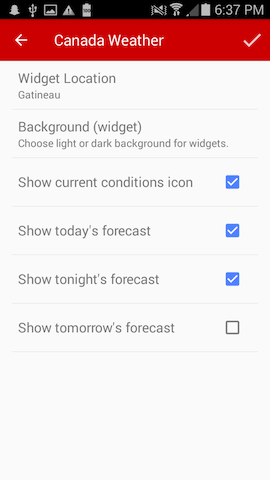  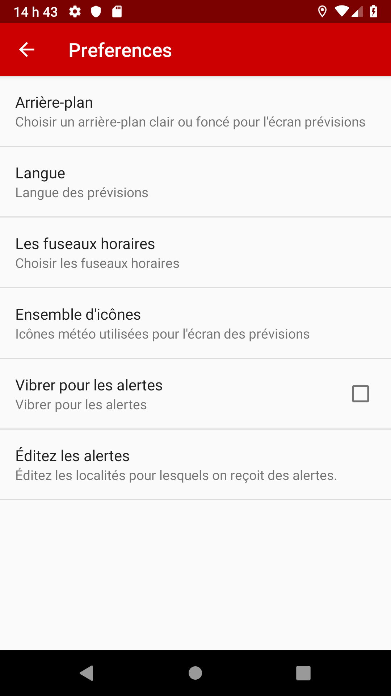 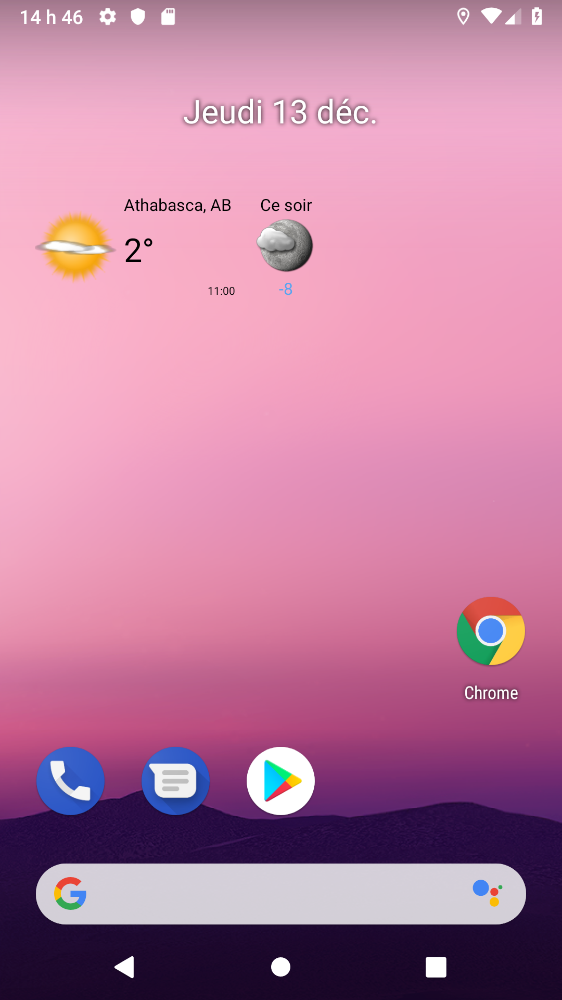